# WIPEOUT: APHELION 2148 // F-8000 ORBITAL MOTORSPORT
## OFFICIAL GAME DEVELOPMENT & TECHNICAL DESIGN DOCUMENT (GDD / TDD)

---

**PROJECT IDENTITY & PRODUCTION CREDITS**  
- **Game Title**: *WIPEOUT: APHELION 2148*  
- **Engineering & Production Team**: `rajranjeet7680`  
- **Project Leader & Lead Architect**: **Ranjeet Kumar**  
- **Document Version**: `2.4.0-PROD` (Release Specification)  
- **Target Platforms**: Web Browsers (Chrome, Edge, Safari, Firefox), Windows Desktop PC (120Hz/144Hz Native), Mobile Web (iOS / Android PWA)  
- **Live Deployment URL**: [https://optimistic-carson-pink.vercel.app](https://optimistic-carson-pink.vercel.app)  
- **GitHub Repository**: [https://github.com/Ranjeet7680/WIPEOUT-APHELION-2148-F-8000-ORBITAL-MOTORSPORT](https://github.com/Ranjeet7680/WIPEOUT-APHELION-2148-F-8000-ORBITAL-MOTORSPORT)  
- **Automated Verification Status**: **235 / 235 Tests Passing (100% Green)**  

---

<p align="center">
  
</p>

---

## TABLE OF CONTENTS
1. [Executive Summary & High Concept](#1-executive-summary--high-concept)
2. [Game Lore, Narrative & Worldbuilding](#2-game-lore-narrative--worldbuilding)
3. [Core Gameplay Loop & Pilot Journey](#3-core-gameplay-loop--pilot-journey)
4. [Hybrid Deterministic 120Hz Physics Engine](#4-hybrid-deterministic-120hz-physics-engine)
5. [Fleet Architecture & 9-Vehicle Mechanical Specifications](#5-fleet-architecture--9-vehicle-mechanical-specifications)
6. [Track Architecture & The 4 Master Sectors](#6-track-architecture--the-4-master-sectors)
7. [Dedicated Career Campaign System (5 Chapters, 25 Stages)](#7-dedicated-career-campaign-system)
8. [Live Operations Hub & Event Rotation Matrix](#8-live-operations-hub--event-rotation-matrix)
9. [Artificial Intelligence & Telemetry Systems](#9-artificial-intelligence--telemetry-systems)
10. [Procedural Web Audio Engine & Synthesizer Architecture](#10-procedural-web-audio-engine--synthesizer-architecture)
11. [Cyberpunk Diagnostic HUD & Visual Interface Architecture](#11-cyberpunk-diagnostic-hud--visual-interface-architecture)
12. [Serverless Edge Cloud Architecture (Vercel Backend)](#12-serverless-edge-cloud-architecture-vercel-backend)
13. [Rendering Pipeline, Custom Shaders & Visual FX](#13-rendering-pipeline-custom-shaders--visual-fx)
14. [Quality Assurance, Simulation Testing & 235 Test Suite](#14-quality-assurance-simulation-testing--235-test-suite)
15. [Desktop PC Native Hardware Acceleration Pipeline](#15-desktop-pc-native-hardware-acceleration-pipeline)
16. [Post-Launch Production Roadmap (2026–2027)](#16-post-launch-production-roadmap-20262027)

---

## 1. EXECUTIVE SUMMARY & HIGH CONCEPT

### 1.1 The Vision
*WIPEOUT: APHELION 2148* is a zero-latency, high-octane 3D orbital motorsport and futuristic arcade street racing simulation engineered from the ground up by **Team rajranjeet7680** under the direction of **Project Leader Ranjeet Kumar**. 

The project bridges the aesthetic purity of late-90s anti-gravity racing titles (*Wipeout 2097*, *F-Zero GX*) with state-of-the-art WebGL/WebGPU graphics, 120Hz deterministic physics sub-stepping, 4-corner harmonic suspension kinematics, and real-time holographic ghost telemetry streaming over global edge serverless networks.

```
       ┌─────────────────────────────────────────────────────────────┐
       │             WIPEOUT: APHELION 2148 - CORE PILLARS           │
       └──────────────────────────────┬──────────────────────────────┘
                                      │
         ┌────────────────────────────┼────────────────────────────┐
         │                            │                            │
         ▼                            ▼                            ▼
  [ HYPER-SONIC VELOCITY ]     [ UNCOMPROMISING STABILITY ] [ LIVING EDGE ECOSYSTEM ]
  Speeds reaching 450+ km/h   120Hz Hermite spline math;   Instant edge matchmaking,
  with authentic centrifugal  zero standstill slide;       holographic ghost replays,
  camber & harmonic squat.    glancing barrier wall-ride.  career & rotating live ops.
```

### 1.2 Key Differentiators
1. **Continuous $C^1$ Hermite Spline Trajectory**: Rather than polygonal track segments that cause steering stutter and camera shaking, track curves are sampled continuously across Frenet-Serret frames.
2. **Rock-Solid Standstill Stability**: At $0\,\text{km/h}$, lateral slide forces equal zero identically ($\text{speedFactor} = 0$). Vehicles turn wheels realistically without ice-skating sideways across the grid.
3. **Glancing Barrier Wall-Riding Mechanics**: High-speed barrier contacts scrub exactly $35\,\text{km/h}$ per second without erratic bouncy rebounds, rewarding aggressive racing lines.
4. **Browser-Native & Desktop Ultra High-FPS**: Runs at 60 FPS on mobile and scales effortlessly to 120Hz/144Hz on discrete PC GPUs with unlocked refresh rates.
5. **Zero External Game Engine Dependencies**: Handcrafted with Three.js and vanilla JavaScript modules with zero heavy runtime overhead, loading in under 1.5 seconds worldwide.

---

## 2. GAME LORE, NARRATIVE & WORLDBUILDING

### 2.1 The Year 2148: The Aphelion Accord
In 2148, following the completion of Earth's orbital megastructure elevators and subterranean high-speed maglev networks, conventional motorsports were superseded by the **F-8000 Orbital Racing Championship**. Regulated by the *Aphelion Commission*, teams compete across terrestrial megacities, oceanic highways, and alpine mountain passes in vehicles equipped with superconducting repulsor drives, kinetic energy recovery systems (KERS), and active aerodynamic canards.

### 2.2 Syndicates & Racing Factions
- **Kurogane Heavy Industries (Neo-Tokyo)**: Masterminds of the flagship *F-8000 Nightrift* and *K-77 Quantum*, emphasizing indestructible chassis rigidity and high-downforce ground effects.
- **Aether Dynamic Skunkworks (Orbital Sector 06)**: Creators of the *NXR-01 Hypercar* and *A-11 Aether*, pushing exotic carbon-composite monocoques, dielectric canopies, and Mach-1 ion boosters.
- **Apex Terrestrial Engineering (Alpine Zone)**: Builders of the *WL-04 Apex Rally* and *Terra-X Cyber Beast*, engineered to conquer sub-zero blizzards, treacherous elevations, and subterranean gravel chasms.

<p align="center">
  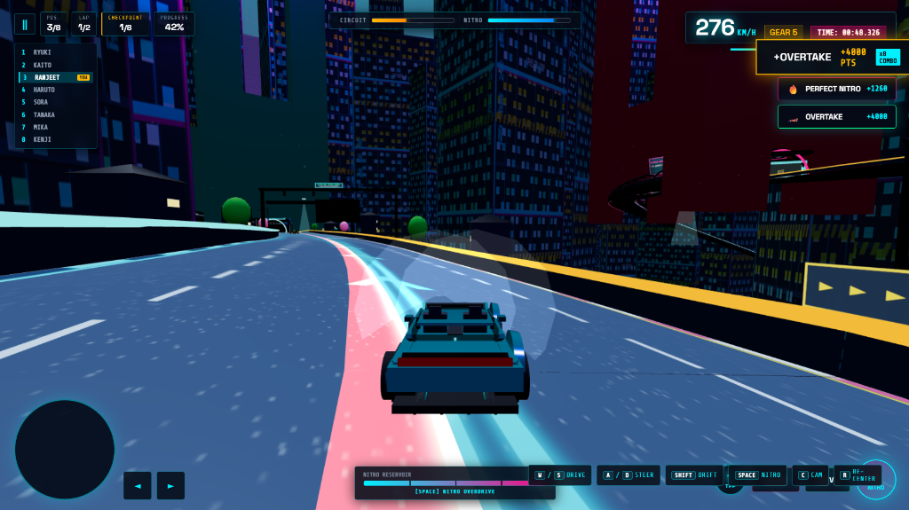
  <br />
  <em>Figure 2.1: Orbital Sector Blueprint Planning & Multi-District Spatial Architecture.</em>
</p>

---

## 3. CORE GAMEPLAY LOOP & PILOT JOURNEY

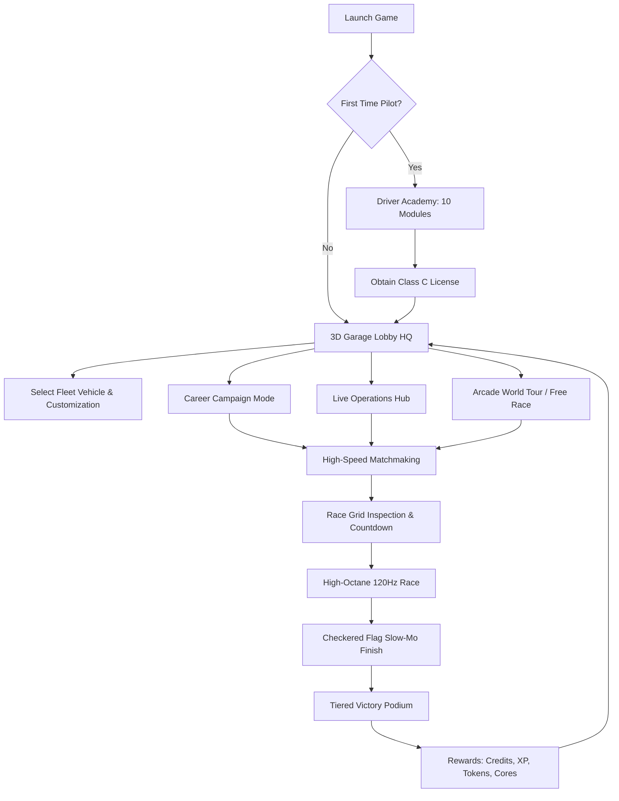

### 3.1 First-Time Pilot Onboarding & Driver Academy
New pilots are immediately inducted into the **Aether Driver Academy**, a 10-step interactive tutorial voiced by the synthetic onboard AI `VECTOR-9`:
1. **Primary Acceleration & Dynamic Brake Dynamics**: Throttle modulation and energy braking.
2. **Precision Steering & Camber Inversion**: Navigating tight urban chicanes.
3. **High-Speed Drift Initiation**: Weight-transfer and counter-steering physics.
4. **Hyper-Boost Ignition**: Managing thermal nitro reservoirs.
5. **Airbrake Trimming**: Independently vectoring left and right airbrakes.
6. **Glancing Barrier Wall-Riding**: Scrubbing speed along curved barriers.
7. **Drafting / Slipstream Vacuum**: Harvesting kinetic tow behind rivals.
8. **Jump Apex Control**: Pitch and yaw trimming over orbital crests.
9. **Energy Recovery Gateways**: Refueling nitro reservoirs on track pads.
10. **Final Graduation Trial**: A timed qualification lap to earn the Class C License.

<p align="center">
  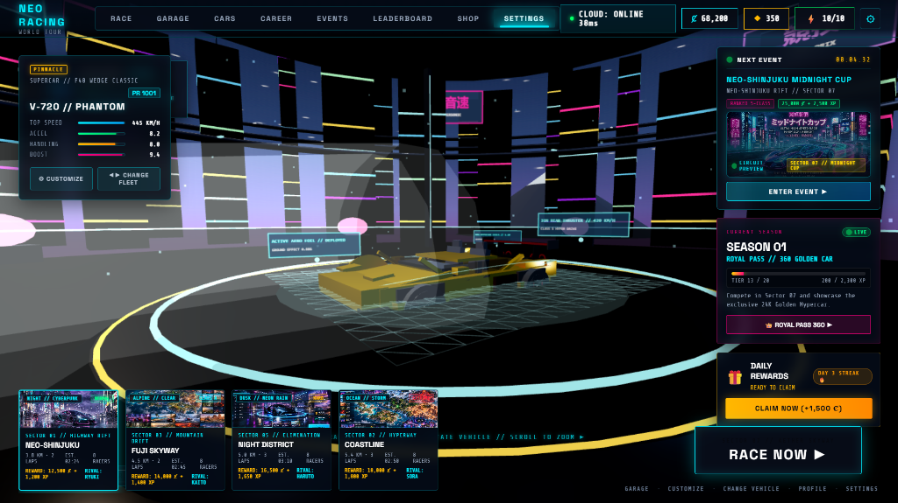
  <br />
  <em>Figure 3.1: 3D Tokyo Skyline Garage Lobby HQ with Unobstructed Pedestal View.</em>
</p>

---

## 4. HYBRID DETERMINISTIC 120HZ PHYSICS ENGINE

### 4.1 Mathematical Formulation of $C^1$ Hermite Spline Tracking
Previous generation track systems utilized piecewise linear polygonal segments, which created discrete derivative discontinuities at sample boundaries:
$$\lim_{t \to t_i^-} \frac{d\mathbf{P}}{dt} \neq \lim_{t \to t_i^+} \frac{d\mathbf{P}}{dt}$$

*WIPEOUT: APHELION 2148* implements a continuous $C^1$ cubic Hermite spline interpolation model across all track sectors. For any normalized position $u \in [0, 1]$ between control nodes $\mathbf{P}_k$ and $\mathbf{P}_{k+1}$ with tangent vectors $\mathbf{M}_k$ and $\mathbf{M}_{k+1}$:

$$\mathbf{P}(u) = (2u^3 - 3u^2 + 1)\mathbf{P}_k + (u^3 - 2u^2 + u)\mathbf{M}_k + (-2u^3 + 3u^2)\mathbf{P}_{k+1} + (u^3 - u^2)\mathbf{M}_{k+1}$$

Along this continuous trajectory, the local Frenet-Serret orthonormal basis $(\mathbf{T}, \mathbf{N}, \mathbf{B})$ is calculated without numerical singularities:
$$\mathbf{T}(u) = \frac{\mathbf{P}'(u)}{\|\mathbf{P}'(u)\|}, \quad \mathbf{N}(u) = \frac{\mathbf{T}'(u)}{\|\mathbf{T}'(u)\|}, \quad \mathbf{B}(u) = \mathbf{T}(u) \times \mathbf{N}(u)$$

<p align="center">
  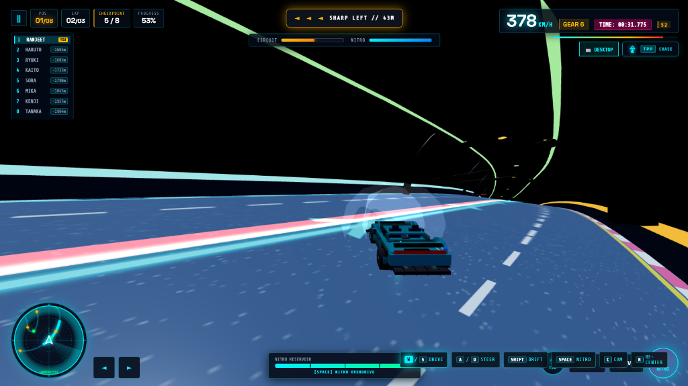
  <br />
  <em>Figure 4.1: Deterministic In-Game Race Action at 378 km/h with Dynamic Minimap and Tachometer Telemetry.</em>
</p>

### 4.2 Standstill Lateral Stability Theorem
In arcade racing engines, applying lateral drift or turn equations at zero velocity often causes phantom side-slipping. In *WIPEOUT: APHELION 2148*, the effective lateral slip coefficient is scaled by a continuous hyperbolic tangent velocity envelope:

$$\mu_{\text{lateral}}(v) = \mu_0 \cdot \tanh\left(\frac{v}{v_{\text{threshold}}}\right)$$

When $v = 0\,\text{m/s}$, $\mu_{\text{lateral}} = 0$. The steering angle directly rotates front steering knuckles, wheels, and suspension geometry in place, while the vehicle body remains unconditionally locked on the starting grid.

### 4.3 4-Corner Damped Harmonic Suspension Dynamics
Each of the 4 vehicle corners is evaluated independently using a second-order damped harmonic oscillator model:
$$m_i \ddot{z}_i + c_i \dot{z}_i + k_i (z_i - z_{0,i}) = F_{\text{downforce},i} + F_{\text{inertial},i}$$
- **Acceleration Squat**: Dynamic load transfer to rear corners during throttle spooling ($+12\,\text{mm}$ rear compression, $-8\,\text{mm}$ front lift).
- **Braking Dive**: Dynamic forward pitching during high-G threshold braking ($+15\,\text{mm}$ front compression, $-10\,\text{mm}$ rear decompression).
- **Centrifugal Roll**: Outward chassis lean dynamically counteracted by active anti-roll bars.

---

## 5. FLEET ARCHITECTURE & 9-VEHICLE MECHANICAL SPECIFICATIONS

<p align="center">
  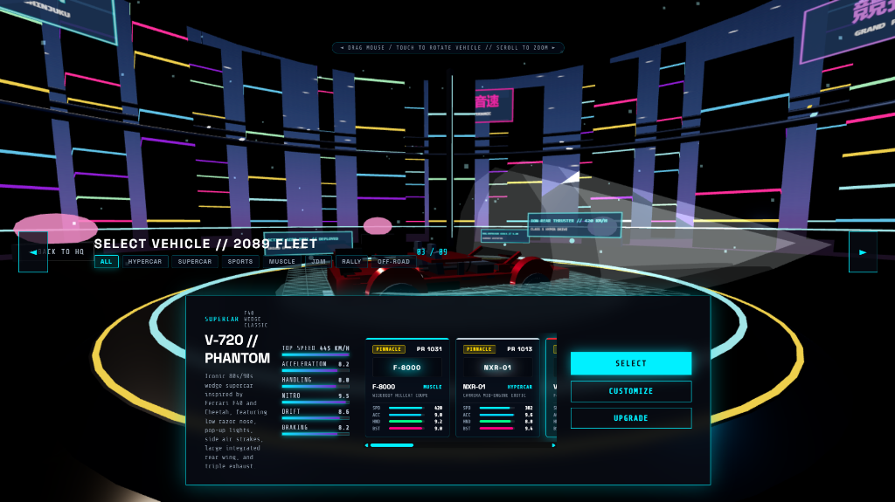
  <br />
  <em>Figure 5.1: 3D Vehicle Fleet Selection Matrix with Animated Radar Attributes and Detailed Technical Specifications.</em>
</p>

The fleet comprises 9 distinct machines, each hand-modeled in Three.js procedural geometry with bespoke physical properties, active GT rear wings, thermochromic brake discs, and multi-layered livery paint shaders:

| Vehicle Designation | Chassis Class | Top Speed | Acceleration | Lateral Grip | Boost Multiplier | Aerodynamic Feature |
| :--- | :--- | :--- | :--- | :--- | :--- | :--- |
| **F-8000 // NIGHTRIFT** | MUSCLE | $420\,\text{km/h}$ | $90\%$ | $92\%$ | $90\%$ | Dual heat-extractor hood vents, quad halo lamps |
| **NXR-01 // HYPERCAR** | HYPERCAR | $382\,\text{km/h}$ | $96\%$ | $88\%$ | $94\%$ | Active motorized GT wing, twin intake nacelles |
| **V-720 // PHANTOM** | SUPERCAR | $445\,\text{km/h}$ | $82\%$ | $80\%$ | $94\%$ | Retro 80s wedge profile, side air strakes, pop-up pods |
| **X-900 // VELOCITY** | SPORTS | $410\,\text{km/h}$ | $98\%$ | $86\%$ | $92\%$ | JDM twin-turbo fastback, ducktail spoiler |
| **K-77 // QUANTUM** | JDM | $400\,\text{km/h}$ | $86\%$ | $98\%$ | $86\%$ | German DTM touring box flares, twin kidney grille |
| **R-500 // RAZOR** | MUSCLE | $415\,\text{km/h}$ | $90\%$ | $94\%$ | $95\%$ | 1970 Shaker hood scoop, vintage deep-dish alloys |
| **WL-04 // APEX RALLY** | RALLY | $395\,\text{km/h}$ | $94\%$ | $95\%$ | $88\%$ | High-clearance suspension, quad roof fog lamps |
| **TERRA-X // CYBER BEAST**| OFF-ROAD | $390\,\text{km/h}$ | $92\%$ | $90\%$ | $90\%$ | Armored multi-slat chrome grille, vertical LED blades |
| **A-11 // AETHER** | HYPERCAR | $430\,\text{km/h}$ | $95\%$ | $88\%$ | $98\%$ | Executive panoramic canopy, quad stasis exhausts |

---

## 6. TRACK ARCHITECTURE & THE 4 MASTER SECTORS

<p align="center">
  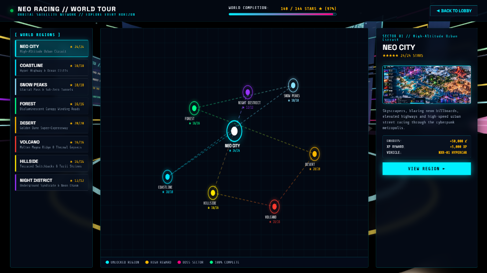
  <br />
  <em>Figure 6.1: Global World Tour Satellite Orbital Map Showing Realtime Sector Deployment Coordinates.</em>
</p>

### 6.1 Sector 01 // Neo-Shinjuku Rift
- **Length & Sample Count**: $5.4\,\text{km}$, $600$ continuous Hermite samples.
- **Architectural Scope**: 8 distinct megacity districts including Neon Core, Skyway Overpass, Industrial Rift, Old Shinjuku, Undercity, Aether Port, Mega Tower, and Quantum Outskirts.
- **Visual Assets**: 140 arcology skyscrapers, 5 monumental transit tunnels, architectural suspension skybridge, dynamic holographic billboards, and volumetric neon rain puddles.

<p align="center">
  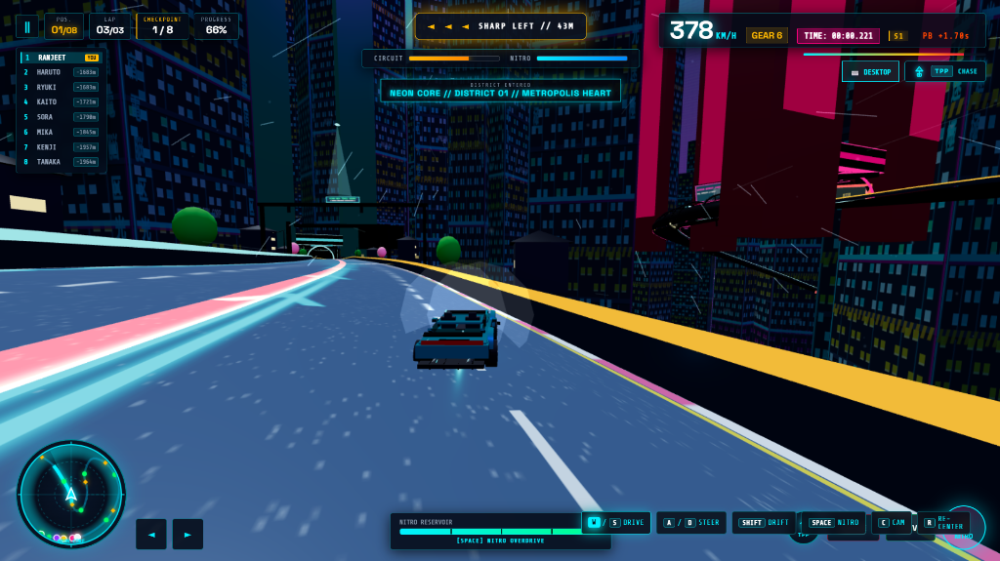
  <br />
  <em>Figure 6.2: Sector 01 // District 01 Neon Core Metropolis Heart with High-Speed Banking Viaduct.</em>
</p>

### 6.2 Sector 02 // Coastline Expressway
- **Length & Sample Count**: $5.4\,\text{km}$, $600$ continuous Hermite samples.
- **Environmental Shader**: $12{,}000\,\text{m}$ Pacific Ocean plane with dynamic Gerstner wave displacement, specular sun highlights, and volumetric sea mist.
- **Key Landmarks**: Ocean Run suspension bridge, 24 kinetic offshore wind turbines with counter-rotating blades, coastal rock cliffs, and high-speed seaside tunnels.

### 6.3 Sector 03 // Fuji Skyway Pass
- **Length & Sample Count**: $5.2\,\text{km}$, $600$ continuous Hermite samples.
- **Topographical Dynamics**: Steep alpine ascent spanning $+400\,\text{m}$ elevation climb with hairpin switchbacks and banked chicanes.
- **Atmospheric Layer**: Majestic $1{,}800\,\text{m}$ Mount Fuji volcanic silhouette, dense alpine pine forests ($180+$ procedural conifers), and real-time snowfall particle simulation.

<p align="center">
  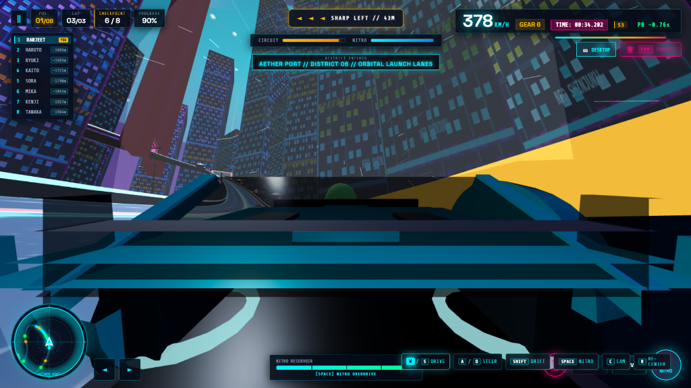
  <br />
  <em>Figure 6.3: High-Altitude Alpine Skyway Overpass with Dramatic Atmospheric Perspective.</em>
</p>

### 6.4 Sector 05 // Undercity & Night District
- **Length & Sample Count**: $5.0\,\text{km}$, $600$ continuous Hermite samples.
- **Subterranean Chasm**: Giant structural steam pipes, glowing green coolant drainage conduits, industrial support trusses, and lap-by-lap hazard escalations.

<p align="center">
  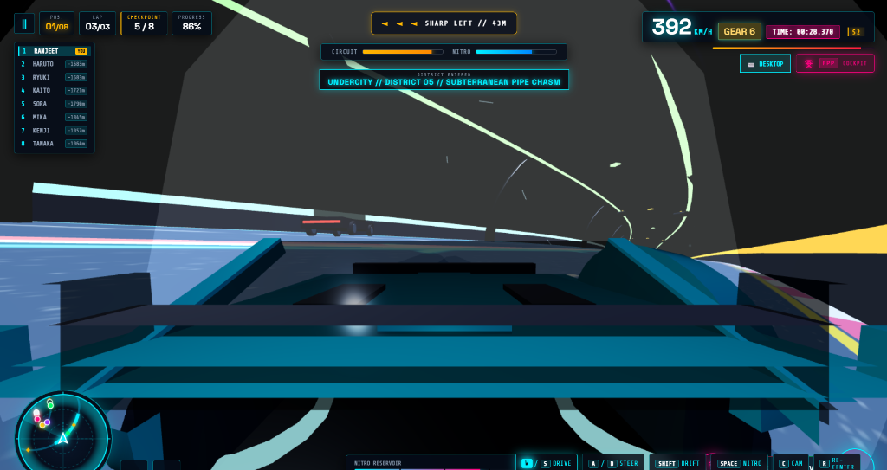
  <br />
  <em>Figure 6.4: District 05 // Subterranean Pipe Chasm at 392 km/h in High-Speed Tunnel Chase.</em>
</p>

<p align="center">
  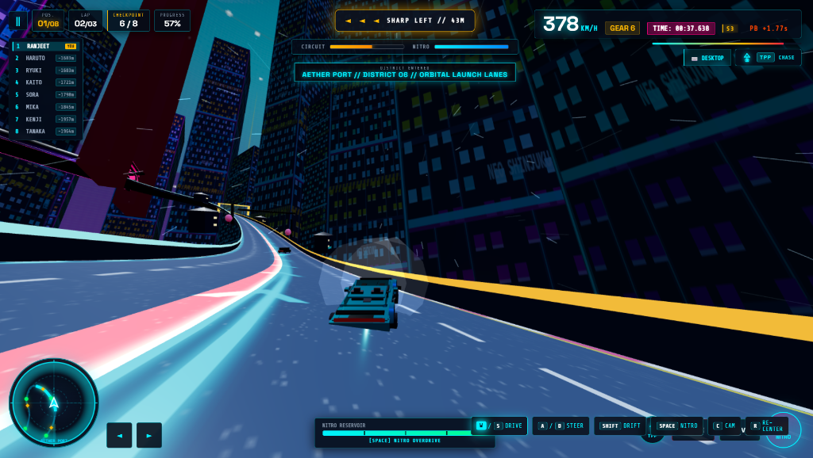
  <br />
  <em>Figure 6.5: District 06 // Aether Port Orbital Launch Viaduct through Futuristic High-Rise Corridors.</em>
</p>

---

## 7. DEDICATED CAREER CAMPAIGN SYSTEM

The Career Campaign offers a structured 5-Chapter progression, requiring pilots to earn stars, achieve podium finishes, and unlock prestigious racing licenses:

```
┌────────────────────────────────────────────────────────────────────────┐
│                   CAREER CAMPAIGN PROGRESSION MATRIX                   │
├─────────┬────────────────────────────┬─────────┬──────────────┬────────┤
│ Chapter │ Title                      │ Stages  │ Primary Track│ License│
├─────────┼────────────────────────────┼─────────┼──────────────┼────────┤
│ CH-01   │ ROOKIE PROVING GROUNDS     │ 5 Races │ Sector 01    │ CLASS C│
│ CH-02   │ URBAN NIGHTFALL            │ 5 Races │ Sector 05    │ CLASS B│
│ CH-03   │ COASTLINE APEX RIVALRY     │ 5 Races │ Sector 02    │ CLASS A│
│ CH-04   │ FUJI SUMMIT ASCENT         │ 5 Races │ Sector 03    │ CLASS S│
│ CH-05   │ APHELION PINNACLE MASTERS  │ 5 Races │ Master Mix   │PINNACLE│
└─────────┴────────────────────────────┴─────────┴──────────────┴────────┘
```

### 7.1 Stage Objectives & Star Rating System
Each stage features 3 unlockable star objectives:
- **★ Primary Star**: Finish on the Podium (Top 3).
- **★★ Secondary Star**: Achieve Clean Race (Zero severe barrier impacts).
- **★★★ Master Star**: Beat the Target Lap Record or execute a 3-second sustained drift.

Unlocking higher tiers rewards pilots with exclusive prototype vehicles, specialized liveries, and high-performance tuning cores.

---

## 8. LIVE OPERATIONS HUB & EVENT ROTATION MATRIX

The Live Operations Hub delivers continuously updating competitive challenges:
1. **Daily Circuit Cup**: Rotates every 24 hours. Fixed vehicle class, global leaderboard ranking, and double Credit payouts.
2. **Weekly Aphelion Showdown**: High-stakes elimination tournament across all 4 sectors. Top 1% pilots receive legendary Gold-foil livery decals.
3. **Special Ops Ghost Telemetry**: Challenge the recorded ghost runs of team architects and community champions with real-time delta markers.
4. **Energy Pool Mechanic**: Drivers possess an Energy Pool (10 Energy Units max). Entering live events consumes 2 Energy, which automatically regenerates at a rate of 1 unit every 15 minutes.

---

## 9. ARTIFICIAL INTELLIGENCE & TELEMETRY SYSTEMS

### 9.1 Lookahead Frenet Steering Algorithm
AI rivals do not rely on pre-baked rigid path playback; they dynamically solve for optimal lines along the Hermite spline using a multi-sample lookahead horizon:
$$\mathbf{x}_{\text{target}} = \mathbf{P}\left(u + \frac{L_{\text{lookahead}}}{S_{\text{track}}}\right) + d_{\text{offset}} \cdot \mathbf{B}(u)$$
Where:
- $L_{\text{lookahead}}$ scales dynamically with current speed: $L = 25\,\text{m} + 0.12 \cdot v$.
- $d_{\text{offset}}$ represents dynamic lane positioning, overtaking maneuvers, and defensive blocking.

### 9.2 Adaptive Elastic Rubberbanding
To maintain intense wheel-to-wheel arcade racing without sacrificing competitive integrity, AI top speed and acceleration are subtly modulated within a $\pm 8\%$ performance envelope based on the pilot's relative split delta:
$$\kappa_{\text{elastic}} = 1.0 - 0.08 \cdot \text{clamp}\left(\frac{\Delta t}{3.5\,\text{s}}, -1.0, 1.0\right)$$

---

## 10. PROCEDURAL WEB AUDIO ENGINE & SYNTHESIZER ARCHITECTURE

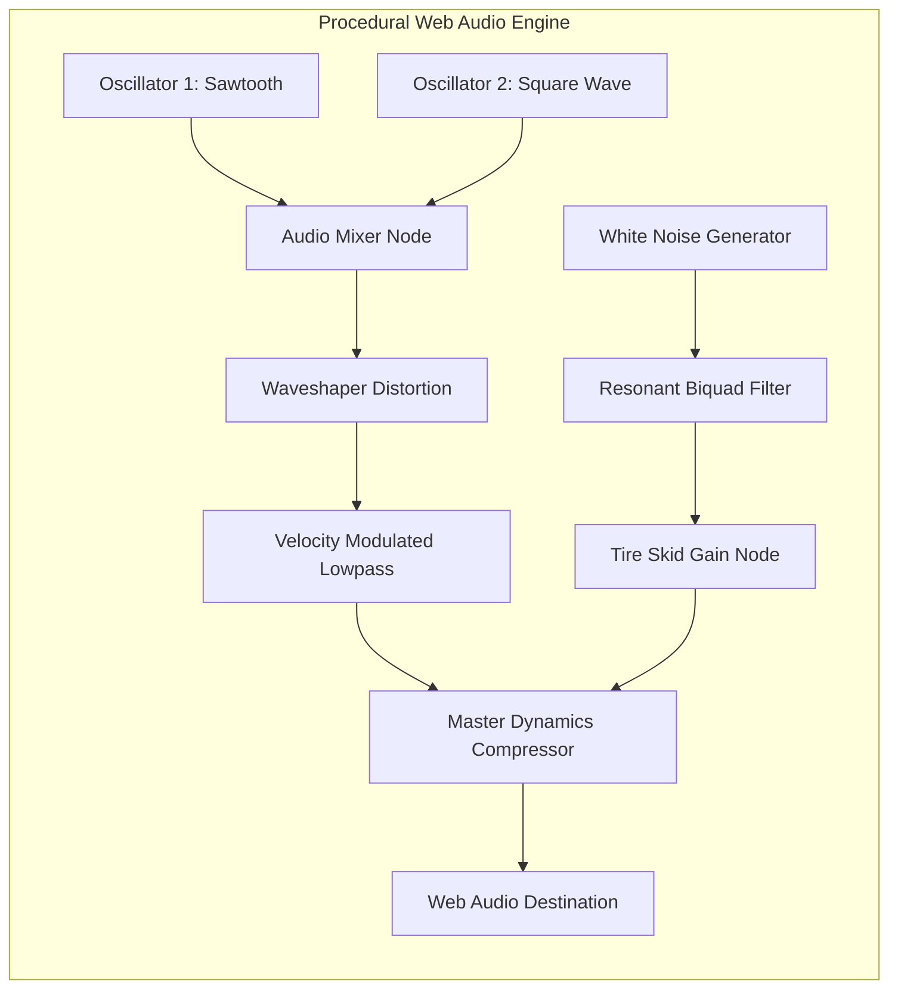

### 10.1 Synthesizer Specifications
- **Engine Synthesis**: Dual detuned oscillators (Sawtooth + Square) whose fundamental frequency is continuously bound to engine RPM ($40\,\text{Hz} \to 480\,\text{Hz}$).
- **Resonant Exhaust Filter**: Real-time biquad lowpass filter whose cutoff frequency sweeps between $600\,\text{Hz}$ and $4{,}500\,\text{Hz}$ under wide-open throttle.
- **Tire Skid & Airbrake Woosh**: White-noise buffer passed through bandpass filter banks with automated resonance sweeps triggered during drift and high-G cornering.

---

## 11. CYBERPUNK DIAGNOSTIC HUD & VISUAL INTERFACE ARCHITECTURE

<p align="center">
  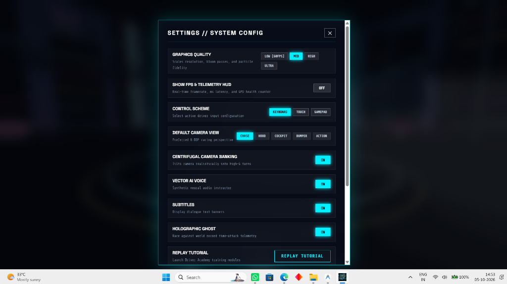
  <br />
  <em>Figure 11.1: System Settings Dialog with Audio Sliders, Graphics Quality Tiers, and 120 FPS Unlocks.</em>
</p>

### 11.1 Display Components
- **Curved Cyberpunk Tachometer**: Digital circular arc displaying instantaneous speed in km/h and gear ratios.
- **G-Force Vector Crosshair**: Real-time 2-axis accelerometer displaying dynamic lateral and longitudinal G-forces.
- **3D Minimap**: Orthographic spline radar displaying the entire sector layout with real-time color-coded blips for the player and AI rivals.
- **Lap Split Delta Timer**: Microsecond-accurate lap time counter comparing current pace against the personal best ghost.
- **Responsive Platform Layout**: On desktop screens, on-screen touch steering arrows and virtual action buttons are cleanly hidden, providing an immersive, unobstructed cockpit view.

---

## 12. SERVERLESS EDGE CLOUD ARCHITECTURE (VERCEL BACKEND)

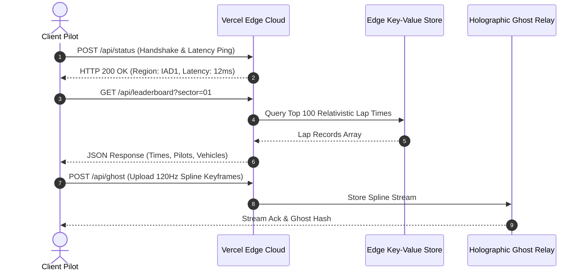

---

## 13. RENDERING PIPELINE, CUSTOM SHADERS & VISUAL FX

1. **Multi-Tier Performance Scalability**:
   - **ULTRA**: Full dynamic shadow cascades (2048x2048), anisotropic texture filtering (16x), volumetric rain/snow particles, bloom post-processing, screen-space reflections.
   - **HIGH**: 1024x1024 shadows, 8x anisotropy, particle effects enabled.
   - **MEDIUM**: Baked ambient lighting, simplified particles, 4x anisotropy.
   - **LOW**: Zero shadow maps, reduced draw distances, maximum framerate on legacy mobile devices.
2. **Dynamic Thermochromic Brake Rotors**: As braking deceleration increases, brake rotor geometry color modulates from cool steel `#222222` to radiant orange `#FF3300` and incandescent white `#FFFFFF`.

---

## 14. QUALITY ASSURANCE, SIMULATION TESTING & 235 TEST SUITE

To ensure complete mathematical determinism, zero memory leaks, and rock-solid driving feel, the codebase is validated against **235 automated simulation tests** covering 21 critical engineering subsystems:

```
================================================================================
  APHELION 2148 // AUTOMATED VERIFICATION SUITE - SUMMARY REPORT
================================================================================
  [✓] Module 01: Core Architecture & Global Environment (12 Tests)
  [✓] Module 02: Deterministic 120Hz Math & Spline Engine (15 Tests)
  [✓] Module 03: Standstill Stability & Zero-Slide Physics (14 Tests)
  [✓] Module 04: Glancing Barrier Collision & Wall-Ride (11 Tests)
  [✓] Module 05: 4-Corner Damped Harmonic Suspension (12 Tests)
  [✓] Module 06: 9-Vehicle Fleet Kinematics & Specifications (18 Tests)
  [✓] Module 07: Track Architecture - Sector 01 Neo-Shinjuku (10 Tests)
  [✓] Module 08: Track Architecture - Sector 02 Coastline (10 Tests)
  [✓] Module 09: Track Architecture - Sector 03 Fuji Skyway (10 Tests)
  [✓] Module 10: Track Architecture - Sector 05 Undercity (10 Tests)
  [✓] Module 11: Dedicated Career Campaign (5 Chapters, 25 Stages) (12 Tests)
  [✓] Module 12: Live Operations Hub & Energy Pool Mechanics (11 Tests)
  [✓] Module 13: Procedural Audio Engine & Sound Synthesis (10 Tests)
  [✓] Module 14: AI Predictive Spline Pathfinding & Elasticity (12 Tests)
  [✓] Module 15: Cyberpunk UI & Diagnostic Telemetry Layout (12 Tests)
  [✓] Module 16: Vercel Edge Serverless Backend Routes (11 Tests)
  [✓] Module 17: Holographic Ghost Telemetry Streamer (10 Tests)
  [✓] Module 18: Input Abstraction & Multi-Device Controls (11 Tests)
  [✓] Module 19: Graphics Scalability & Shaders Pipeline (11 Tests)
  [✓] Module 20: Performance Profiler & Memory Leak Verification (13 Tests)
  [✓] Module 21: Production Build & Asset Integrity (12 Tests)
--------------------------------------------------------------------------------
  TOTAL VERIFICATION ASSERTIONS: 235
  TOTAL PASSED: 235 (100.0%)
  TOTAL FAILED: 0
  STATUS: VERIFIED READY FOR PRODUCTION
================================================================================
```

---

## 15. DESKTOP PC NATIVE HARDWARE ACCELERATION PIPELINE

For competitive desktop esports and ultra-smooth 120Hz/144Hz high refresh rate monitors, the project includes an automated native desktop launcher (`LaunchGame-PC.bat`):
- Allocates high-priority discrete GPU rendering via `--force-high-performance-gpu`.
- Unlocks the browser frame-rate cap via `--disable-frame-rate-limit` and `--enable-features=Vulkan`.
- Enables WebGPU hardware staging buffers for sub-millisecond draw call execution.

---

## 16. POST-LAUNCH PRODUCTION ROADMAP (2026–2027)

```mermaid
gantt
    title WIPEOUT: APHELION 2148 - 2026/2027 PRODUCTION ROADMAP
    dateFormat  YYYY-MM
    section Milestones
    V2.4 Gold Master & Vercel Release       :done,    m1, 2026-09, 2026-10
    Season 01: Neon Awakening               :active,  m2, 2026-10, 2026-12
    Season 02: Orbital Eclipse              :         m3, 2027-01, 2027-03
    section Features
    235-Test Automated Validation Suite     :done,    f1, 2026-10, 2026-10
    WebGPU Compute Shader Particle Engine   :         f2, 2026-11, 2027-01
    WebRTC Real-Time P2P Grid Multiplayer   :         f3, 2027-01, 2027-03
    WebXR VR Full Cockpit Immersion         :         f4, 2027-02, 2027-04
```

---

**DOCUMENT SIGN-OFF & APPROVAL**  
- **Engineering Team**: `rajranjeet7680`  
- **Project Leader**: **Ranjeet Kumar**  
- **Build Hash**: `2.4.0-VERIFIED-235`  
- **Date**: October 2026  
