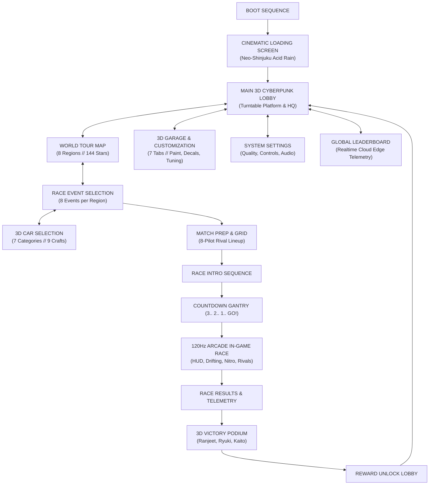

# 🏁 NEO RACING // WORLD TOUR — Official Wiki
> **Developed by Ranjeet Kumar**  
> **Aether-9 Championship // Year 2089 Orbital Motorsport**

Welcome to the official documentation for **NEO RACING — WORLD TOUR**, an AAA-style futuristic cyberpunk arcade racing game and playable interactive simulation. 

Inspired by high-speed anti-gravity motorsport classics, NEO RACING blends ultra-fluid 120Hz arcade physics, magnetic apex drifting, holographic neon user interfaces, dynamic weather, and global world tour progression across 8 distinct biomes.

---

## 🏎️ Player Identity & Profile
- **Lead Pilot**: `RANJEET` (Callsign: `NIGHTRIFT-01`)
- **Pilot Rank**: `LEVEL 87`
- **Career XP**: `8,450 / 12,000 XP`
- **Currency**: `45,200 Ȼ Credits` | `350 ◆ Premium Tokens`
- **Grid Energy**: `10 / 10 ⚡`
- **World Tour Completion**: `140 / 144 Stars ★` (97% Completed)
- **Active Season**: `SEASON 07 // AETHER SKYWAY`

---

## 🎮 Complete Application Flow

---

## ⚡ Key Highlights & Systems

| Feature | Description |
| :--- | :--- |
| **120Hz Arcade Physics Engine** | Sub-stepped physics simulation with zero heap allocations during racing loops, realistic surface friction, and centrifugal roll banking. |
| **Magnetic Apex Drifting** | High-G drifting mechanics converting kinetic friction directly into plasma boost reserves. |
| **Hyper-Boost Overdrive** | Two-tier propulsion: Standard Boost and resonance Overdrive activated within the 60%-85% pulse window. |
| **8 World Tour Regions** | Distinct environments ranging from rainy Neo-Shinjuku skyscrapers to glacial mountain tunnels and active volcanic rims. |
| **9 Futuristic Racing Craft** | 7 vehicle categories (`HYPERCAR`, `SUPERCAR`, `SPORTS`, `MUSCLE`, `JDM`, `RALLY`, `OFF-ROAD`) with unique handling profiles. |
| **7-Tab Hangar Bay Tuning** | Full customization including metallic paints, custom decals, repulsor wheel styles, neon underglow, exhaust flames, and performance upgrades. |
| **Competitive 8-Racer Grid** | 7 AI rivals with unique aggression styles: `Ryuki`, `Kaito`, `Haruto`, `Sora`, `Tanaka`, `Mika`, and `Kenji`. |
| **Serverless Edge Cloud** | Vercel-optimized endpoints for anti-cheat verified lap times, edge telemetry relays, and holographic ghost keyframes. |

---

## 🕹️ Controls Guide

### ⌨️ Desktop Controls
- **Drive / Throttle**: `[W]` or `[↑]`
- **Brake / Reverse**: `[S]` or `[↓]`
- **Steer Left / Right**: `[A]` / `[D]` or `[←]` / `[→]`
- **Magnetic Drift**: `[LEFT SHIFT]` (Hold while cornering)
- **Hyper-Boost / Nitro**: `[SPACE]`
- **Airbrakes**: `[Q]` (Left) / `[E]` (Right)
- **Cycle 6-DOF Camera**: `[C]` (Chase, Hood, Cockpit, Bumper, Action, Drone)
- **Pause Race**: `[ESC]` or `[P]`
- **Toggle World Map**: `[M]`
- **Toggle Garage**: `[G]`

### 📱 Mobile & Touch Controls
- Dedicated on-screen steer arrows `[◄]` `[►]`
- Primary touch buttons for `DRIVE`, `BRAKE`, and `NITRO`
- Quick camera toggle and holographic radar minimap

---

## 📖 Wiki Table of Contents
1. [[World-Tour-Map-&-Regions]] — The 8 regions, star completion, and race event archetypes.
2. [[Vehicle-Catalog-&-Customization]] — Complete fleet stats, car categories, and 7-tab garage upgrades.
3. [[Physics-&-Driving-Mechanics]] — 120Hz physics, drifting, slipstreaming, and aerial stunt detection.
4. [[AI-Rivals-&-Multiplayer-Grid]] — The 7 AI rivals, leaderboard tower, and holographic ghost telemetry.
5. [[Architecture-&-Vercel-Deployment]] — WebGL/WebGPU graphics pipeline, Vercel serverless APIs, and performance optimizations.
